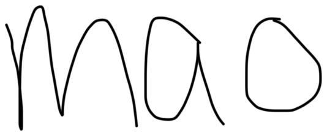
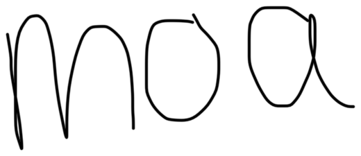

```{r setup, include=FALSE}
knitr::opts_chunk$set(
  echo = TRUE,
  eval = TRUE,
  warning = FALSE,
  message = FALSE,
  comment = NA,
  class.output = "r-output"
)
knitr::opts_knit$set(root.dir = normalizePath("lplus-2026-dataprocessing-ws"))
options(width = 78, pillar.print_min = 6, pillar.print_max = 10)
library(tidyverse)
library(readxl)
library(haven)
```

```{r embed-slide-helper, echo=FALSE, results='asis'}
# Embed the helper so RPubs keeps the output formatting.
slide_helper <- readLines("../assets/code-highlight.js", warn = FALSE)
cat("<script>\n", paste(slide_helper, collapse = "\n"), "\n</script>\n")
```

## Jens Roeser

<div class="intro-profile">
<div>

- Associate Professor in Psycholinguistics, Nottingham Institute of Psychology, Nottingham Trent University
- Focus: real-time planning in written language production
- Methods: Bayesian modelling, keystroke logging, eye tracking
- Teaching: (advanced) inferential statistics, data processing, data visualisation / dashboards
- Contact: `jens.roeser@ntu.ac.uk`
- <span class="bluesky-account"><a href="https://bsky.app/profile/sentwrite.bsky.social">&#64;sentwrite.bsky.social</a></span>

</div>
<div class="intro-visuals">
<div class="location-map-wrap" aria-label="World map showing Nottingham in the United Kingdom">

<span class="map-arrow"></span>
<span class="map-label">Nottingham, UK</span>
<div class="uk-inset" aria-hidden="true">

<span class="uk-dot"></span>
</div>
</div>
</div>
</div>

## Why Preprocess Data?

Most time spent working with data is not spent running statistical tests.

It is spent turning raw data into evidence we can trust.

Preprocessing matters because it:

- checks whether the data match what happened in the study
- documents decisions about exclusions, recoding, and missing values
- protects raw data from manual spreadsheet edits
- makes the workflow reproducible with open-source tools
- creates analysis-ready data for statistics, figures, and sharing

## Overview

<div class="pipeline">
  <div class="pipeline-box"><span class="panel-title">Project</span>Know where files live</div>
  <div class="pipeline-arrow">&rarr;</div>
  <div class="pipeline-box"><span class="panel-title">Read</span>CSV, Excel, SPSS</div>
  <div class="pipeline-arrow">&rarr;</div>
  <div class="pipeline-box"><span class="panel-title">Inspect</span>Check structure using e.g. <span class="inline-code">glimpse</span></div>
  <div class="pipeline-arrow">&rarr;</div>
  <div class="pipeline-box"><span class="panel-title">Process</span><span class="inline-code">select</span>, <span class="inline-code">filter</span>, <span class="inline-code">mutate</span></div>
  <div class="pipeline-arrow">&rarr;</div>
  <div class="pipeline-box"><span class="panel-title">Summarise</span>Use <span class="inline-code">summarise</span> + <span class="inline-code">.by</span></div>
</div>

Throughout, I will first introduce functions which we then practice in exercises. Everything will be made available.

## Download The Workshop Folder From GitHub

Run one line in R:

```{r eval=FALSE}
source(url("https://tinyurl.com/lplus-dataprocessing-ws"))
```

This creates:

- `lplus-2026-dataprocessing-ws/`

Then open the provided R project file for this workshop:

- `lplus-2026-dataprocessing-ws/lplus-2026-dataprocessing-ws.Rproj`

## RStudio Projects: `.Rproj`

<p class="question">An RStudio Project is a folder-based workspace.</p>

What it does:

- marks the workshop folder as one self-contained project
- opens RStudio in the correct working directory

Why it matters:

- paths start from the project folder
- scripts, data, slides, and exercises stay together

## Why Projects Matter

With the project open, these paths work:

```{r eval = F}
read_csv("data/chinese_ldt.csv")
```

Without the project open, R may look in the wrong folder.

Check your current project folder:

```{r eval=F}
getwd()
```

Example:

```{r eval=FALSE}
"/home/jensroes/lplus-2026-dataprocessing-ws"
```

## Creating A Project

For your own work later:

- **File > New Project**
- choose **New Directory** or **Existing Directory**
- keep raw data in a `data/` folder
- keep scripts in a `scripts/` or `r/` folder (today we use `exercises/`)
- open the `.Rproj` file before working

Project paths should be relative:

```{r eval=FALSE}
read_csv("data/my_data.csv")
```

## Installing And Loading Packages

```{r eval=FALSE}
install.packages("tidyverse")
```

Install packages once. Installing `tidyverse` also installs `readxl` and `haven`.

```{r eval=FALSE}
library(tidyverse)
library(readxl)
library(haven)
```

Load packages in every new R session where you want to use their functions.

## What Is The Tidyverse?

The tidyverse is a collection of R packages for working with data.

- `readr` reads table-like text files, such as CSV files
- `readxl` reads Excel files
- `haven` reads SPSS, Stata, and SAS files
- `dplyr` transforms and summarises data
- `tidyr` changes data shape
- `ggplot2` makes plots

The packages share a common style: data first, instructions second.

## One Shared Pattern

<p class="question">Most tidyverse data processing functions follow one logic.</p>

```{r eval=FALSE}
verb(data, instructions)
```

Examples:

```{r eval=FALSE}
select(data, variable)
filter(data, variable > 100)
mutate(data, new_variable = old_variable * 2)
summarise(data, mean_variable = mean(variable))
```


## Tidyverse And Base R

The tidyverse versions use consistent function names and avoid repeatedly typing the data frame name inside each instruction.

<div class="comparison-table">

<div class="comparison-grid">
  <div class="comparison-header">Goal</div>
  <div class="comparison-header">Base R</div>
  <div class="comparison-header">Tidyverse</div>

  <div>select variables</div>
  <div><code>data[, c("ppt_id", "rt")]</code></div>
  <div><code>select(data, ppt_id, rt)</code></div>

  <div>filter rows</div>
  <div><code>data[data&#36;rt &gt; 2000, ]</code></div>
  <div><code>filter(data, rt &gt; 2000)</code></div>

  <div>create a variable</div>
  <div><code>data&#36;rt_sec &lt;- data&#36;rt / 1000</code></div>
  <div><code>mutate(data, rt_sec = rt / 1000)</code></div>

  <div>summarise</div>
  <div><code>mean(data&#36;rt)</code></div>
  <div><code>summarise(data, mean_rt = mean(rt))</code></div>
</div>

</div>


## Chinese Lexical Decision Task

Participants saw stimulus images in Chinese or Latin script and decided whether each one was a real word. Example item for *cat*:

<table class="stimulus-table ldt-stimuli">
  <tr>
    <th>Script</th>
    <th>Word</th>
    <th>Nonword</th>
  </tr>
  <tr>
    <td>Chinese</td>
    <td></td>
    <td></td>
  </tr>
  <tr>
    <td>Latin</td>
    <td></td>
    <td></td>
  </tr>
</table>

<p class="source-note">Each row in the dataset is one response trial from the online task.</p>

**Note:** The original export was far more messy than what we will work with.

## More Variables

The data also contain useful predictors and item information.

Task variables:

- `ppt_id`, `trial`, `stimulus`, `script`, `lexicality`
- `word_eng`, `response`, `correct_response`

Participant variables:

- `age`, `language_status`

Outcome variables:

- `rt`, `rt_sec`, `correct`

## Reading CSV Files

```{r}
chinese_ldt <- read_csv("data/chinese_ldt.csv")
```

`read_csv` returns a tibble. 

```{r}
class(chinese_ldt)
```

Base R returns a data frame. 

```{r}
chinese_ldt_base <- read.csv("data/chinese_ldt.csv")
class(chinese_ldt_base)
```


## Why Use Tibbles?

Tibbles are modern data frames designed for interactive work.

They are useful because they:

- print compactly instead of filling the console
- show variable types such as `<chr>`, `<dbl>`, and `<lgl>`
- make it easier to notice when column names changed during import
- avoid surprise changes such as automatically turning text into factors
- work smoothly with tidyverse verbs such as `select`, `filter`, `mutate`, and `summarise`

## Reading Excel Files

```{r}
library(readxl)

chinese_ldt_excel <- read_excel("data/chinese_ldt.xlsx")
```

Use this when collaborators send `.xlsx` files.

## Reading SPSS Files

```{r eval=FALSE}
library(haven)

chinese_ldt_spss <- read_sav("data/chinese_ldt.sav")
```

Use this when data come from SPSS.

## RStudio Import Dataset

For spreadsheet-style importing:

- Use **Import Dataset**
- Choose the file
- Check the preview
- Copy the generated code into your script

The non-code route is useful for discovery, but the generated code should still end up in the script.

## Inspect Before Changing

```{r eval=FALSE}
glimpse(chinese_ldt)
names(chinese_ldt)
count(chinese_ldt, lexicality)
```

Open `exercises/01_reading_inspecting.R`.

## Three Core Data Processing Tools

Many tidyverse functions are useful, but three verbs do much of the everyday work:

- `select` chooses columns
- `filter` chooses rows
- `mutate` creates or changes columns

Together, these three functions let you make a raw data frame smaller, cleaner, and more useful for analysis.

## Selecting Variables

Keep only the variables you need.

```{r}
select(chinese_ldt, ppt_id, stimulus, rt)
```

## Selecting Many Variables

```{r}
select(chinese_ldt, ppt_id, stimulus, contains("response"))
```

## Dropping Variables

Use `-` inside `select` to remove variables.

```{r}
select(chinese_ldt, -word_eng, -rt_sec, -stimulus, -language_status)
```

## Store The Result

Tidyverse functions return a new data frame.

```{r eval=FALSE}
select(chinese_ldt, ppt_id, stimulus, rt)
```

This shows the result, but does not save it.

```{r eval=FALSE}
chinese_ldt_small <- select(chinese_ldt, ppt_id, stimulus, rt)
```

This saves the result so the next line can use `chinese_ldt_small`.


## Filtering Rows

Keep rows that match a condition.

```{r eval=FALSE}
filter(chinese_ldt, lexicality == "word") # notice the double equals!
```

```{r echo = F}
filter(chinese_ldt, lexicality == "word") %>% select(ppt_id, trial, script, lexicality, rt)
```
## Filtering Rows

Keep rows that don't match a condition.

```{r eval=FALSE}
filter(chinese_ldt, lexicality != "word") # notice the exclamation point
```

```{r echo = F}
filter(chinese_ldt, lexicality != "word") %>% select(ppt_id, trial, script, lexicality, rt)
```


## Filtering Rows

Keep rows that match a condition.

```{r eval=FALSE}
filter(chinese_ldt, rt > 2000) # `>` means "larger than"
```

```{r echo = F}
filter(chinese_ldt, rt > 2000) %>% select(ppt_id, trial, script, lexicality, rt)
```


## Filtering With Multiple Conditions

```{r eval=FALSE}
filter(chinese_ldt, rt > 2000, lexicality == "word")
```

```{r eval=FALSE}
filter(chinese_ldt, lexicality %in% c("word", "nonword"))
```

## Missing Values

Some participants have no coded `language_status`.

```{r echo=FALSE}
tibble(
  ppt_id = c(1, 4, 43, 45, 50),
  age = c(22, 24, 30, 29, 20),
  language_status = c(
    "balanced",
    NA,
    NA,
    NA,
    "balanced"
  )
)
```

Missing values are `NA`, not `"NA"`.

## Missing Values

```{r eval=F}
filter(chinese_ldt, is.na(language_status)) # find missing values
```

```{r eval=FALSE}
filter(chinese_ldt, !is.na(language_status)) # remove missing values
```

or

```{r eval = FALSE}
drop_na(chinese_ldt, language_status)
```


## Creating Variables

`mutate` adds or changes columns.

```{r eval=FALSE}
mutate(
  chinese_ldt,
  rt_sec = rt / 1000
)
```

```{r echo = F}
mutate(
  chinese_ldt,
  rt_sec = rt / 1000
) %>% select(ppt_id, trial, script, lexicality, rt, rt_sec)
```


## More Mutate Examples

```{r eval=FALSE}
mutate(
  chinese_ldt,
  correct = response == correct_response,
  slow_trial = rt > mean(rt)
)
```

Open `exercises/02_select_filter_mutate.R`.

## Descriptive Summaries

```{r}
summarise(
  chinese_ldt,
  mean_rt = mean(rt),
  sd_rt = sd(rt),
  accuracy = mean(correct),
  n = n()
)
```

## Summaries By Group

Use `.by` for grouped summaries.

```{r}
summarise(
  chinese_ldt,
  mean_rt = mean(rt),
  sd_rt = sd(rt),
  accuracy = mean(correct),
  n = n(),
  .by = lexicality
)
```

## Two Grouping Variables

```{r}
summarise(
  chinese_ldt,
  mean_rt = mean(rt),
  accuracy = mean(correct),
  n = n(),
  .by = c(script, lexicality)
)
```

Open `exercises/03_summarise_by.R`.

## Integrated Exercise

Build a short preprocessing workflow:

1. Read with `read_csv`
2. Inspect with `glimpse`
3. Reduce with `select` and `filter`
4. Create with `mutate`
5. Summarise with `.by`

Open `exercises/04_integrated_live_exercise.R`.

## Recommended Reading

<div class="reading-columns">
<div>

Wickham, H., Çetinkaya-Rundel, M., & Grolemund, G. (2023). *R for data science* (2nd ed.). O'Reilly Media. <https://r4ds.hadley.nz/>

- [6 Workflow: scripts and projects](https://r4ds.hadley.nz/workflow-scripts.html)
- [3 Data transformation](https://r4ds.hadley.nz/data-transform.html)
- [5 Data tidying](https://r4ds.hadley.nz/data-tidy.html)
- [7 Data import](https://r4ds.hadley.nz/data-import.html)
- [20 Spreadsheets](https://r4ds.hadley.nz/spreadsheets.html)

</div>
<div>

Andrews, M. (2021). *Doing data science in R: An introduction for social scientists*. SAGE. <https://www.mjandrews.org/book/ddsr/>

- [2 Introduction to R](https://github.com/mark-andrews/ddsr/releases/download/v22.7.31/chapter_02_introduction.pdf)
- [3 Data Wrangling](https://github.com/mark-andrews/ddsr/releases/download/v22.7.31/chapter_03_wrangling.pdf)
- [7 Reproducible Data Analysis](https://github.com/mark-andrews/ddsr/releases/download/v22.7.31/chapter_07_reproducible.pdf)

</div>
</div>

## Follow-Up Practice: A New Dataset

<div class="function-overview">

| Function | Use it for |
|---|---|
| `read_csv` / `read_excel` / `read_sav` | read common file formats into R |
| `glimpse` | inspect variable names and types before editing |
| `select` | keep or drop variables to make data more manageable |
| `filter` | remove errors, practice trials, or implausible responses |
| `mutate` | create or change variables needed for analysis |
| `summarise` + `.by` | turn trial-level data into grouped descriptive results |

</div>

- Apply the same workflow to `data/blomkvist.csv`.
- Follow-up script: `exercises/06_followup_blomkvist.R`.
- A useful next step is pipe-based preprocessing workflows: `|>` or `%>%`.


## Tidy Data And Pivoting

Wide summary:

```{r echo=FALSE}
tibble(
  ppt_id = 1,
  word_rt = 812,
  nonword_rt = 940
)
```

Tidy summary:

```{r echo=FALSE}
tibble(
  ppt_id = c(1, 1),
  lexicality = c("word", "nonword"),
  rt = c(812, 940)
)
```

When conditions are stored in one column, we can use the same tidyverse verbs across conditions instead of writing separate code for each condition.

## Pivoting For Reshaping Data Frames

```{r}
chinese_ldt_summary <- summarise(
  chinese_ldt,
  mean_rt = mean(rt),
  .by = c(ppt_id, lexicality)
)
```

```{r echo = F}
chinese_ldt_summary
```


## Pivot Wider 

Create one row per participant, with separate columns for words and nonwords.

```{r}
chinese_ldt_summary_wide <- pivot_wider(
  chinese_ldt_summary,
  names_from = lexicality,
  values_from = mean_rt
)
```

```{r echo = F}
chinese_ldt_summary_wide
```


## Pivot Longer

```{r}
pivot_longer(
  chinese_ldt_summary_wide,
  cols = c(word, nonword),
  names_to = "lexicality",
  values_to = "mean_rt"
)
```

## Pivoting exercise

<p class="pivot-exercise-note"> <span class="inline-code">exercises/05_optional_pivoting_backup.R</span>.</p>
